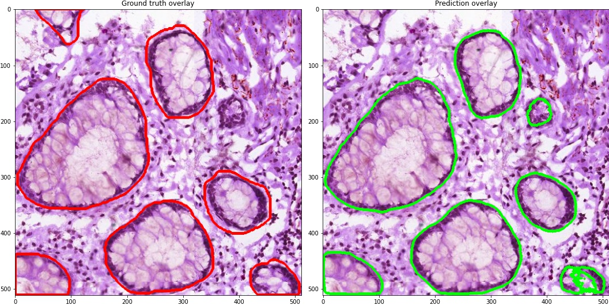
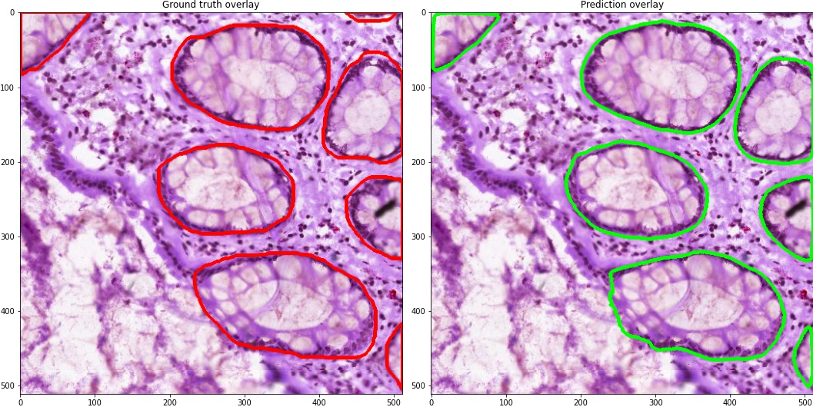
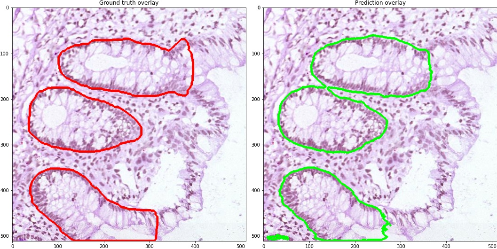
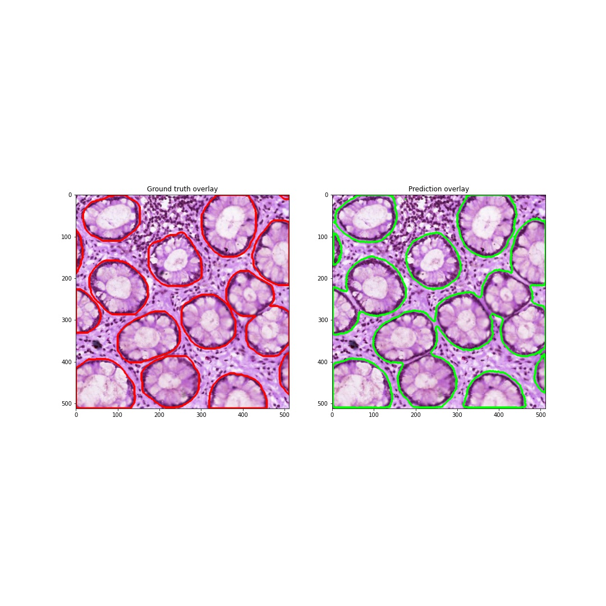
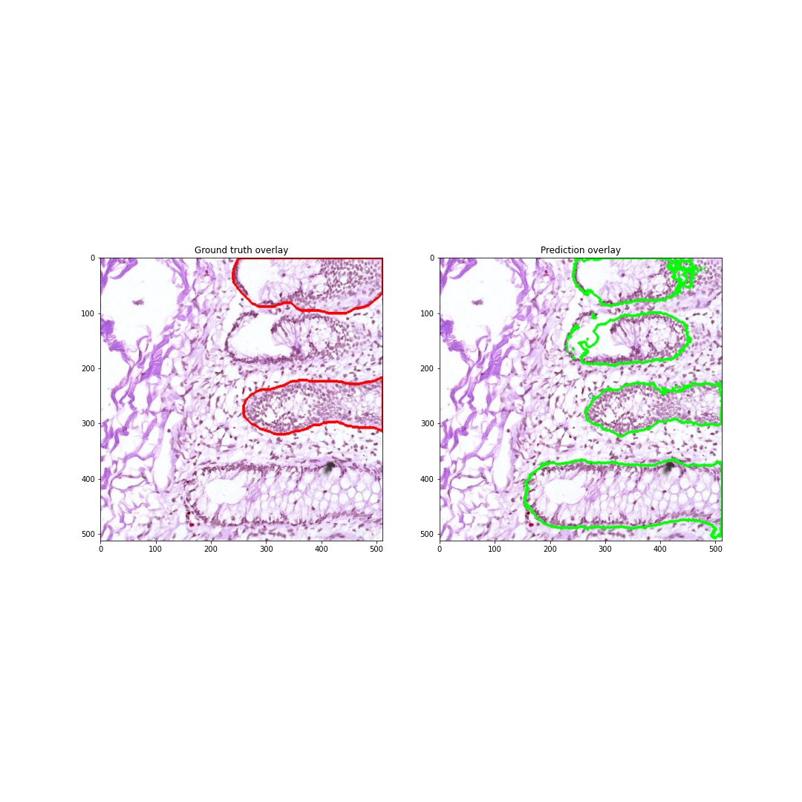
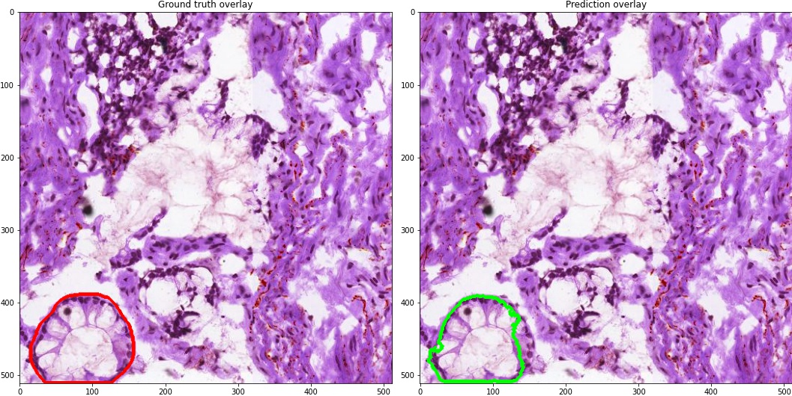

# colon crypt segmentation 
- **2 - Image Segmentation Task**


**Deep Learning Framework used** : Pytorch

This repository contains pytorch codes to do colon crypt segmentation.

Repository struture
```
models/
overlays/
Datapreparation.ipynb
Inference.ipynb
Mask_from_RLE.ipynb
Training.ipynb
Viz.ipynb
utils.py
patch_extractor.py 
requirements.txt
submission.csv
.>
.>
.>
```

**Data Description:**

**Dataset** - https://drive.google.com/file/d/1RHQjRav-Kw1CWT30iLJMDQ2hPMyIwAUi/view?usp=sharing

After downloading the data and extracting the files in the above directory structure, it has the following directory structure

```
Colonic_crypt_dataset

     .  train/
     .  train_mask/
     .  test/
     .  test_mask/
     .  train.csv
     .  test.csv
     .  colon-dataset_information.csv

```
**train/** has training H & E images and the annotation jsons
**test/** has test H & E images and the annotation jsons
**train_mask/** has training mask for all the images
**test_mask/** has training mask for all the images
**train.csv** has training image ids and their corresponding Run-Length Annotations
**test,csv** has test image ids and their corresponding Run-Length Annotations.

**Data Preprocessing**

- Mask Generation

    - The dataset already has masks generated for training and test sets. But if required, use **Mask_from_RLE.ipynb** notebook to generate masks from RLR using the train and test csv files.
    
    
 - Patch Generation
   - The training image shape is (4536, 4704,3). So, generated patches of shape (512,512,3) for training. 
   - For patch generation, used window size of (512,512) and stride of (256,256). So there was slight overlap. The patch generation was "valid". Also, code to ignore patches with black rectangular artifacts found on our training and testing WSIs is implemted.
   
    - For patch generation, **Datapreparation.ipynb** notebook is used. This notebook creates a **data/images** and **data/masks** directories to save the image patches and their coreesponding masks. The notebook also returns a csv **train_data.csv** that has the following three columns.
        - Train_image_path
        - Train_mask_path
        - Class (1 if mask contain crypt annotation,else 0)
        
        
    - We use the csv generated here as an input to out pytorch Dataset to access images and masks.
    

**Training** 

 - Dataset
     - We use the **train_data.csv** previously generated to access the training data.
     - Applied the following transforms on the training data (in utils.py):
         ```
         A.Compose([
            A.HorizontalFlip(),
            A.VerticalFlip(),
            A.RandomRotate90(),
            A.ShiftScaleRotate(shift_limit=0.0625, scale_limit=0.2, rotate_limit=15, p=0.9,
                             border_mode=cv2.BORDER_REFLECT),
            A.OneOf([
                A.ElasticTransform(p=.3),
                A.GaussianBlur(p=.3),
                A.GaussNoise(p=.3),
                A.OpticalDistortion(p=0.3),
                A.GridDistortion(p=.1),
                A.PiecewiseAffine(p=0.3),
            ], p=0.3),
            A.OneOf([
                A.HueSaturationValue(15,25,0),
                A.CLAHE(clip_limit=2),
                A.RandomBrightnessContrast(brightness_limit=0.3, contrast_limit=0.3),
            ], p=0.3),

         ```
     - I trained segmentation models using Linknet, Unet, UnetPlusPlus and  Multi-Attention networs architectures with different backbone encoders like efficientnet-b2, efficientnet-b3, resnet50 etx.
     - Unet and UnetPlusPlus architectures performed the best with Unet with efficientnetb2 fetching me the best dice score.
     - Trained the model for 5 folds. 
     - Used crossentropy loss for training, with Ranger optimizer (RAdam + Lookahead).
     For Ranger optimizer please install
     ```
     pip3 install torch-optimizer 
     ```
    - Implemented early stopping with patience=5 monitoring the validation loss.
    - The training steps with metrics and losses per each epoch of every fold is stored as csv file in **models/** folder.

    
**Inference**

 - The inference script (inference.ipynb) performs infernce on the test data and generates submission csv. It has a lot of helper functions to predict masks at patch level and stictching back th mask patches to the original mask, for calculating the  dice socre, and generating the submission csv.
 - This notebook generates the followung csvs:
     - submission.csv (contains test data image ids and RLE of their corresponding predicted mask)
     - dice_report_submission.csv (Has the information of test set dice score per image and their average dice score)
     - dice_report_train_predictions.csv (Has the information of train set dice score per image and their average dice score)
 - Test data scores  
 ```
                   id	                dice
1	CL_HandE_1234_B004_bottomleft	0.922929778972226
2	HandE_B005_CL_b_RGB_bottomleft	0.7634746349031302
3	      Average	                0.8432022069376781
```
     
- Train data dice score
```              
	          id	                    dice
1	CL_HandE_1234_B004_bottomright	0.936980592055458
2	CL_HandE_1234_B004_topleft	    0.9195726177015423
3	CL_HandE_1234_B004_topright  	0.9216310830724985
4	HandE_B005_CL_b_RGB_bottomright	0.8983568682591906
5	HandE_B005_CL_b_RGB_topleft	    0.9104829978846856
6	   Average	                     0.9174048317946749
```
** The inference is done by predicting over all the 5 models we trained and then taking the acverage pixelwise probabilities.

**Predictions**
 - The inference.ipynb has a code to overlay predictions on the original patch. Below are the sample outputs.
  
  
 
 


 
**Incorrectly segmented outputs**

- The below images are some examples where the model didn't perform well.
 
 
 
 
 I think the model didn't perform well on the above example because, majority of the crypts in training examples have darker boundary texture and the inside is more often than not lighter. In the example above, the missegmented crypt doesn't seem to have a definite dark boundary.
 
 
 
 Here is another example where the model didn't perform well.
 
 I think the number of crypts examples in traning data is  lower than the background class. Increasing the crypt data will help improve the segmentation results.
 
 
**Visualizations**

 notebook - **viz.ipynb**
 
 - 
 
 
 
 
 
 

 
 

 

 
    
  

